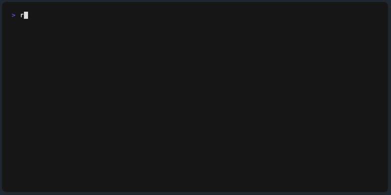

# run-proxy-server


[](https://www.npmjs.com/package/run-proxy-server)
[](https://www.npmjs.com/package/run-proxy-server)
[](https://www.npmjs.com/package/run-proxy-server)
[](https://bundlephobia.com/package/run-proxy-server)
[](https://www.npmjs.com/package/run-proxy-server)
[](https://github.com/piecioshka/run-proxy-server/actions/workflows/testing.yml)

Simple CLI tool to run a local HTTP/HTTPS proxy server with built-in caching, powered by vanilla Node.js.



> Give a ⭐️ if this project helped you!

## Features

- 🚀 Create a local proxy server (HTTP or HTTPS)
- ⚡ Cache proxied responses to avoid redundant network requests
- 💾 Cache stored in `~/.cache/run-proxy-server`, keyed by a SHA-256 hash of the full URL
- 🧰 Supports a denylist to exclude specific URLs or patterns from caching
- 🎯 Denylist patterns support wildcards (`*`)

## Quick Start

### Install

```bash
npm install -g run-proxy-server
```

Or run without installing:

```bash
npx run-proxy-server http://example.com --port 8000
```

### One-time HTTPS setup

If you plan to proxy an HTTPS target, run this once first:

```bash
run-proxy-server --setup-https
# or
npx run-proxy-server --setup-https
```

This creates `certs/key.pem` and `certs/cert.pem` for local HTTPS.

### HTTP

```bash
run-proxy-server http://example.com --port 8000
```

Then make requests to the proxy:

```bash
curl http://localhost:8000/
```

### HTTPS

After the one-time HTTPS setup above, start the proxy pointing to an HTTPS target:

```bash
run-proxy-server https://example.com --port 8443
```

If you prefer manual certificate creation instead of `--setup-https`, you can run:

```bash
mkdir -p certs
openssl req -x509 -newkey rsa:2048 -keyout certs/key.pem -out certs/cert.pem -days 365 -nodes -subj "/CN=localhost"
```

> **Note:** Browsers will show a security warning for self-signed certificates — this is expected in local development. For production, use a certificate from a trusted CA (e.g. [Let's Encrypt](https://letsencrypt.org/)).

## Options

| Argument/Option | Required | Default | Description                                        |
| --------------- | -------- | ------- | -------------------------------------------------- |
| `URL`           | yes      | —       | Target URL to proxy requests to                    |
| `--port`        | no       | `8000`  | Port for the local proxy server                    |
| `--denylist`    | no       | —       | Comma-separated URL patterns to exclude from cache |
| `--no-cache`    | no       | `false` | Disable cache reads and writes for this process    |
| `--clear-cache` | no       | `false` | Remove all cached responses and exit               |
| `--setup-https` | no       | `false` | Generate local HTTPS certificates and exit         |

## Examples

### Proxy an API with caching

```bash
run-proxy-server https://api.github.com --port 8000

# First request — proxied and cached
curl http://localhost:8000/users/octocat

# Second request — served from cache (no network call)
curl http://localhost:8000/users/octocat
```

### Exclude dynamic endpoints from cache

```bash
run-proxy-server https://example.com --port 8000 --denylist "*/api/*,*.json"

# API calls are never cached (always fresh)
curl http://localhost:8000/api/users

# Static assets are cached
curl http://localhost:8000/index.html
```

### Disable cache entirely for a run

```bash
run-proxy-server https://example.com --port 8000 --no-cache

# Every request is fetched from upstream (cache is bypassed)
curl http://localhost:8000/
```

### Denylist pattern syntax

Patterns are matched against the full URL. `*` matches any characters.

| Pattern                     | Matches                               |
| --------------------------- | ------------------------------------- |
| `*.json`                    | `https://example.com/data.json`       |
| `*/api/*`                   | `https://example.com/api/users`       |
| `*/admin/*`                 | `https://example.com/admin/dashboard` |
| `https://cdn.example.com/*` | `https://cdn.example.com/image.png`   |

Multiple patterns are separated by commas:

```bash
--denylist "*/api/*,*.json,*/admin/*"
```

## Cache

Responses live in `$XDG_CACHE_HOME/run-proxy-server`, falling back to
`~/.cache/run-proxy-server`. The cache belongs to the user, not to the
package - installed globally, the package directory sits inside
`node_modules`, which is read-only in many setups and wiped on every
reinstall.

- **First request**: proxied to the target, response saved to the cache
- **Subsequent requests**: served directly from the cache
- **Denylisted URLs**: always fetched fresh, never cached
- **`--no-cache` mode**: cache is fully disabled (no reads and no writes)
- **Expiry**: entries are valid for 365 days; set `CACHE_TTL_HOURS` to change
  the window, or `0` to keep them forever

Each entry is a JSON file named after the first 32 hex characters of the
SHA-256 hash of the URL. Binary bodies are stored base64-encoded.

```bash
# Keep responses for an hour instead of a year
CACHE_TTL_HOURS=1 run-proxy-server https://example.com
```

Clear the cache at any time:

```bash
run-proxy-server --clear-cache
# or
npx run-proxy-server --clear-cache
```

---

## Development

Run with auto-reload on file changes:

```bash
npm run dev -- https://example.com --port 8000
```

## Testing

```bash
npm test
```

Tests cover cache operations, denylist pattern matching, and error handling across Node.js 18, 20, 22, and 24.

## 🤝 Contributing

Contributions, issues and feature requests are welcome!<br />
Feel free to check [issues page](https://github.com/piecioshka/run-proxy-server/issues/).

## License

[The MIT License](https://piecioshka.mit-license.org) @ 2026
